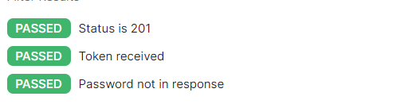
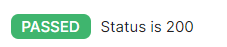
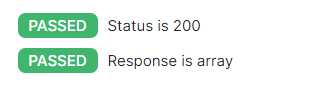
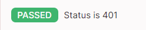

# Documentation of Testing Restaurant Kitchen Service  

## Login Page — Test Cases

### TC-LOGIN-001 — Successful login with valid credentials

| Field | Value |
|---|---|
| **TC-ID** | TC-LOGIN-001 |
| **Title** | Successful login with valid credentials |
| **Module** | Login Page |
| **Priority** | Critical |
| **Preconditions** | User account exists (username: `Vadym`, password: `Viloker123!`) |
| **Steps** | 1. Open `http://localhost:3000/login` <br> 2. Enter valid username <br> 3. Enter valid password <br> 4. Click **Sign In** |
| **Expected Result** | User is redirected to `/dishes`. Navbar shows username. |
| **Actual Result** | User is redirected to `/dishes`. Navbar shows username.|
| **Status** | PASS|

---

### TC-LOGIN-002 — Login with wrong password

| Field | Value |
|---|---|
| **TC-ID** | TC-LOGIN-002 |
| **Title** | Login with wrong password |
| **Module** | Login Page |
| **Priority** | Critical |
| **Preconditions** | User account exists |
| **Steps** | 1. Open `/login` <br> 2. Enter valid username <br> 3. Enter incorrect password `wrongPass` <br> 4. Click **Sign In** |
| **Expected Result** | Error message displayed: `Invalid credentials`. User stays on login page. |
| **Actual Result** |Error message displayed: `Invalid credentials`. User stays on login page.  |
| **Status** |PASS |

---

### TC-LOGIN-003 — Login with non-existing username

| Field | Value |
|---|---|
| **TC-ID** | TC-LOGIN-003 |
| **Title** | Login with non-existing username |
| **Module** | Login Page |
| **Priority** | High |
| **Preconditions** | — |
| **Steps** | 1. Open `/login` <br> 2. Enter username `ghost_user` <br> 3. Enter any password <br> 4. Click **Sign In** |
| **Expected Result** | Error message: `Invalid credentials`. |
| **Actual Result** |Error message: `Invalid credentials`. |
| **Status** | PASS |

---

### TC-LOGIN-004 — Login with empty username

| Field | Value |
|---|---|
| **TC-ID** | TC-LOGIN-004 |
| **Title** | Login with empty username field |
| **Module** | Login Page |
| **Priority** | High |
| **Preconditions** | — |
| **Steps** | 1. Open `/login` <br> 2. Leave username empty <br> 3. Enter any password <br> 4. Click **Sign In** |
| **Expected Result** | Field error shown: `Username is required`. Request sent to server. Network tab shows 400 response. |
| **Actual Result** |Field error shown: Username is required. Request sent to server. Network tab shows 400 response. |
| **Status** |PASS |

---

### TC-LOGIN-005 — Login with empty password

| Field | Value |
|---|---|
| **TC-ID** | TC-LOGIN-005 |
| **Title** | Login with empty password field |
| **Module** | Login Page |
| **Priority** | High |
| **Preconditions** | — |
| **Steps** | 1. Open `/login` <br> 2. Enter valid username <br> 3. Leave password empty <br> 4. Click **Sign In** |
| **Expected Result** | Field error shown: `Password is required`. Network tab shows 400 response. |
| **Actual Result** |Field error shown: `Password is required`. Network tab shows 400 response. |
| **Status** | PASS |

---

### TC-LOGIN-006 — Both fields empty

| Field | Value |
|---|---|
| **TC-ID** | TC-LOGIN-006 |
| **Title** | Submit login form with all fields empty |
| **Module** | Login Page |
| **Priority** | Medium |
| **Preconditions** | — |
| **Steps** | 1. Open `/login` <br> 2. Do not fill any field <br> 3. Click **Sign In** |
| **Expected Result** | Both field errors shown. 400 response in Network tab. |
| **Actual Result** |Both field errors shown. 400 response in Network tab. |
| **Status** | PASS |

---

### TC-LOGIN-007 — Redirect when already logged in

| Field | Value |
|---|---|
| **TC-ID** | TC-LOGIN-007 |
| **Title** | Logged-in user cannot access login page |
| **Module** | Login Page / Routing |
| **Priority** | Medium |
| **Preconditions** | User is logged in |
| **Steps** | 1. Log in successfully <br> 2. Manually navigate to `http://localhost:3000/login` |
| **Expected Result** | User is automatically redirected to `/dishes`. |
| **Actual Result** |User is automatically redirected to `/dishes`.|
| **Status** | PASS|

---

### TC-LOGIN-008 — Error disappears when user edits field

| Field | Value |
|---|---|
| **TC-ID** | TC-LOGIN-008 |
| **Title** | Field error clears on input change |
| **Module** | Login Page |
| **Priority** | Low |
| **Preconditions** | — |
| **Steps** | 1. Submit empty form to trigger errors <br> 2. Start typing in the username field |
| **Expected Result** | Username error disappears as soon as user starts typing. |
| **Actual Result** |Username error disappears as soon as user starts typing. |
| **Status** | PASS|

---

### TC-LOGIN-009 — SQL injection attempt

| Field | Value |
|---|---|
| **TC-ID** | TC-LOGIN-009 |
| **Title** | SQL injection in username field |
| **Module** | Login Page / Security |
| **Priority** | Critical |
| **Preconditions** | — |
| **Steps** | 1. Open `/login` <br> 2. Enter `' OR 1=1 --` as username <br> 3. Enter any password <br> 4. Click **Sign In** |
| **Expected Result** | Login fails. Error: `Invalid credentials`. No server crash. |
| **Actual Result** |Login fails. Error: `Invalid credentials`. No server crash.    |
| **Status** |PASS |

---

### TC-LOGIN-010 — Token stored after login

| Field | Value |
|---|---|
| **TC-ID** | TC-LOGIN-010 |
| **Title** | JWT token saved to localStorage on success |
| **Module** | Login Page / Auth |
| **Priority** | High |
| **Preconditions** | Valid account exists |
| **Steps** | 1. Open DevTools → Application → Local Storage <br> 2. Log in with valid credentials |
| **Expected Result** | `token` key appears in localStorage with a JWT string starting with `eyJ`. |
| **Actual Result** |`token` key appears in localStorage with a JWT string starting with `eyJ`. |
| **Status** | PASS|

---  
  
### Setup

1. Create a new Postman Collection: **Restaurant Kitchen Service**
2. Add a Collection Variable: `base_url = http://localhost:5000/api`
3. Add a Collection Variable: `token = ` (empty, filled automatically)
### Task 1 — Register a new cook

```
POST {{base_url}}/auth/register
Content-Type: application/json

{
  "first_name": "Oleg",
  "last_name": "Petrenko",
  "username": "Oleg_cook",
  "email": "oleg@example.com",
  "password": "Secret1!",
  "years_of_experience": 3
}
```

**Tests tab (auto-save token):**
```javascript
pm.test("Status is 201", () => pm.response.to.have.status(201));
pm.test("Token received", () => {
    const json = pm.response.json();
    pm.expect(json.token).to.be.a('string');
    pm.collectionVariables.set("token", json.token);
});
pm.test("Password not in response", () => {
    pm.expect(pm.response.text()).to.not.include('"password"');
});
```
**Result**  
  

---

### Task 2 — Login

```
POST {{base_url}}/auth/login
Content-Type: application/json

{
  "username": "Oleg_cook",
  "password": "Secret1!"
}
```

**Tests tab:**
```javascript
pm.test("Status is 200", () => pm.response.to.have.status(200));
pm.collectionVariables.set("token", pm.response.json().token);
```
**Result** 


---

### Task 3 — Login with wrong password (expect 401)

```
POST {{base_url}}/auth/login
Content-Type: application/json

{
  "username": "Oleg_cook",
  "password": "wrongpassword"
}
```

**Tests tab:**
```javascript
pm.test("Status is 401", () => pm.response.to.have.status(401));
pm.test("Error message present", () => {
    pm.expect(pm.response.json().message).to.be.a('string');
});
```
**Result**


---

### Task 4 — Register with invalid data (expect 400)

```
POST {{base_url}}/auth/register
Content-Type: application/json

{
  "first_name": "A",
  "last_name": "",
  "username": "x",
  "email": "not-an-email",
  "password": "123"
}
```

**Tests tab:**
```javascript
pm.test("Status is 400", () => pm.response.to.have.status(400));
pm.test("Errors object returned", () => {
    pm.expect(pm.response.json().errors).to.be.an('object');
});
```
**Result**  
  

---

### Task 5 — Get dishes (authenticated)

```
GET {{base_url}}/dishes
Authorization: Bearer {{token}}
```

**Tests tab:**
```javascript
pm.test("Status is 200", () => pm.response.to.have.status(200));
pm.test("Response is array", () => {
    pm.expect(pm.response.json()).to.be.an('array');
});
```
**Result**  
  

---

### Task 6 — Get dishes without token (expect 401)

```
GET {{base_url}}/dishes
```
*(no Authorization header)*

**Tests tab:**
```javascript
pm.test("Status is 401", () => pm.response.to.have.status(401));
```  
**Result**  
  

